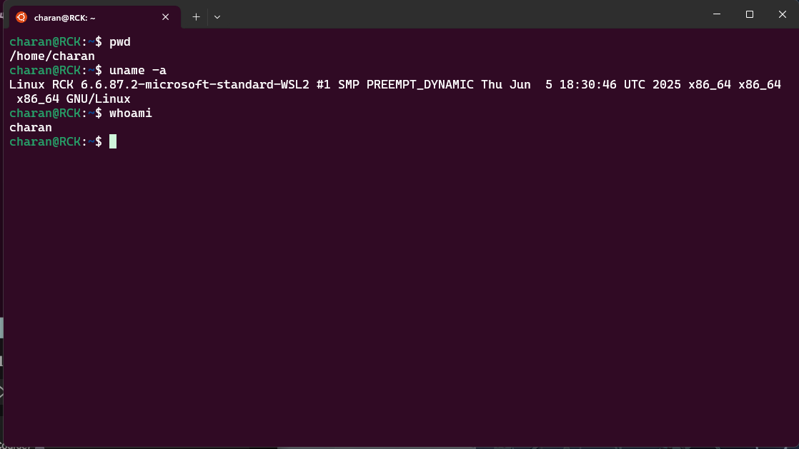
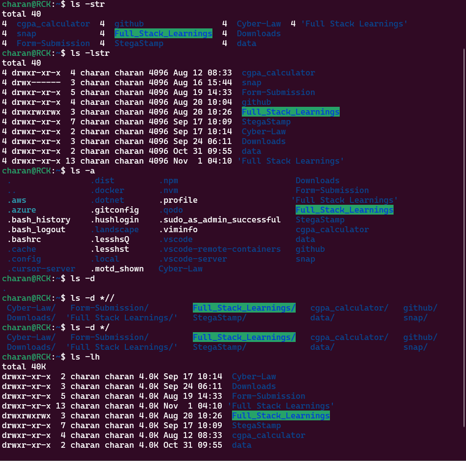

## What is Linux?
```
. Linux is a free, open-source operating system (OS) based on Unix principles.

. It controls the interaction between software and hardware in systems.

. Linux is widely used in servers, embedded systems, smartphones (Android), cloud
computing, DevOps, and supercomputers.

. It is known for its stability, security, and flexibility.

. Linux distributions (distros) like Ubuntu, Fedora, and Debian package the Linux
  kernel with various software to create complete operating systems.

```

## What is WSL?
```
. WSL (Windows Subsystem for Linux) is a compatibility layer developed by Microsoft 
  that allows users to run Linux binary executables natively on Windows 10 and 
  Windows 11.
. WSL enables developers to use Linux command-line tools, utilities, and applications
  directly on a Windows machine without the need for a virtual machine or dual-boot setup.
. WSL 2, the latest version, uses a real Linux kernel running in a lightweight
  virtual machine, providing improved performance and full system call compatibility.
. WSL is particularly useful for developers who work in cross-platform environments,
  as it allows seamless integration between Windows and Linux tools.
```

## Why use Linux with WSL?
```
. Access to a wide range of open-source tools and software available on Linux.  
. Ability to run Linux-specific applications and scripts directly on a Windows machine.
. Enhanced development environment for web development, DevOps, and cloud computing.
. Seamless integration between Windows and Linux file systems and tools.
. Improved performance with WSL 2, which uses a real Linux kernel.
. No need for dual-booting or using resource-intensive virtual machines.
. Ability to leverage the strengths of both Windows and Linux operating systems.
```

## Getting Started with WSL
```
1. Enable WSL on Windows:
    - Open PowerShell as Administrator and run:
        ```powershell
        dism.exe /online /enable-feature /featurename:Microsoft-Windows-Subsystem-Linux /all /norestart
        dism.exe /online /enable-feature /featurename:VirtualMachinePlatform /all /norestart
        ```
2. Restart your computer to apply the changes. 
3. Install a Linux distribution from the Microsoft Store (e.g., Ubuntu, Debian, Fedora).
4. Launch the installed Linux distribution from the Start menu and complete the initial setup.
5. Update and upgrade the Linux packages:
    ```bash
    sudo apt update && sudo apt upgrade
    ```
6. Start using Linux commands and tools within the WSL environment.
```

# Linux commands and tools within the WSL environment.

## Basic Linux Commands
```
- `ls`: List directory contents.
- `cd`: Change directory.
- `pwd`: Print working directory.
- `cp`: Copy files and directories.
- `mv`: Move or rename files and directories.
- `rm`: Remove files or directories.
- `mkdir`: Create a new directory.
- `rmdir`: Remove an empty directory.
- `touch`: Create an empty file or update the timestamp of an existing file.
- `cat`: Concatenate and display file contents.
- `nano` or `vim`: Text editors for editing files in the terminal.
- `sudo`: Execute a command with superuser privileges.
- `apt`: Package manager for Debian-based distributions (e.g., Ubuntu) to install,
  update, and manage software packages.
```

# Every Command has its own set of options and arguments. Use `man <command>` to access the manual pages for detailed information.

## Additional Resources
```
- Official WSL Documentation: https://docs.microsoft.com/en-us/windows/wsl/
- Linux Documentation: https://www.kernel.org/doc/html/latest/
- Linux Command Line Tutorial: https://linuxcommand.org/
- WSL GitHub Repository: https://github.com/microsoft/WSL
```

## Commands 

Display System Information Commands
```
- pwd : print working directory
- uname -a : display system information
- whoami : display current user

```

List Files Commands
```
-ls : list files in long format
-ls -l : list files in long format with detailed information
-ls -a : list all files including hidden files
-ls -la : list all files in long format with detailed information
-ls -lh : list files in long format with human-readable file sizes
-ls -ltr : list files in long format sorted by modification time in reverse order
-ls -lstr : list files in long format sorted by size in reverse order
-ls -R : list files recursively in all subdirectories
-ls -d */ : list only directories
-ls -S : list files sorted by size 


```
Bashrc File Commands
```
- nano ~/.bashrc : open the .bashrc file in the nano text editor
- source ~/.bashrc : apply changes made to the .bashrc file
- echo 'export PATH=$PATH:/new/path' >> ~/.bashrc : add a new path to the PATH variable in .bashrc
- alias ll='ls -la' >> ~/.bashrc : create an alias for the 'ls -la' command in .bashrc
eg:
    -charan@RCK:~$ alias cdl="cd /home/charan/link/test/demo"
    -charan@RCK:~$ cdl
    -charan@RCK:~/link/test/demo$
- export VARIABLE_NAME=value >> ~/.bashrc : set an environment variable in .bashrc
- cat ~/.bashrc : display the contents of the .bashrc file
```

File Manipulation Commands
```
- cp source.txt destination.txt : copy a file
- mv oldname.txt newname.txt : rename or move a file
- rm file.txt : delete a file
- mkdir new_directory : create a new directory
- rmdir empty_directory : remove an empty directory
- touch newfile.txt : create a new empty file
- ln -s /path/to/original /path/to/symlink : create a symbolic link
```

-nohup Command
```
- nohup command & : run a command in the background, ignoring hangup signals
- Example:
    - nohup python3 myscript.py &
    - This will run 'myscript.py' in the background even if the terminal is closed.
- The output will be saved to 'nohup.out' by default.
- To specify a different output file, use:
    - nohup command > output.log 2>&1 &
    - This will redirect both stdout and stderr to 'output.log'.

```

- Disk Usage Commands
```
- df -h : display disk space usage in human-readable format 
- du -sh /path/to/directory : display the total size of a directory in human-readable format
```

-